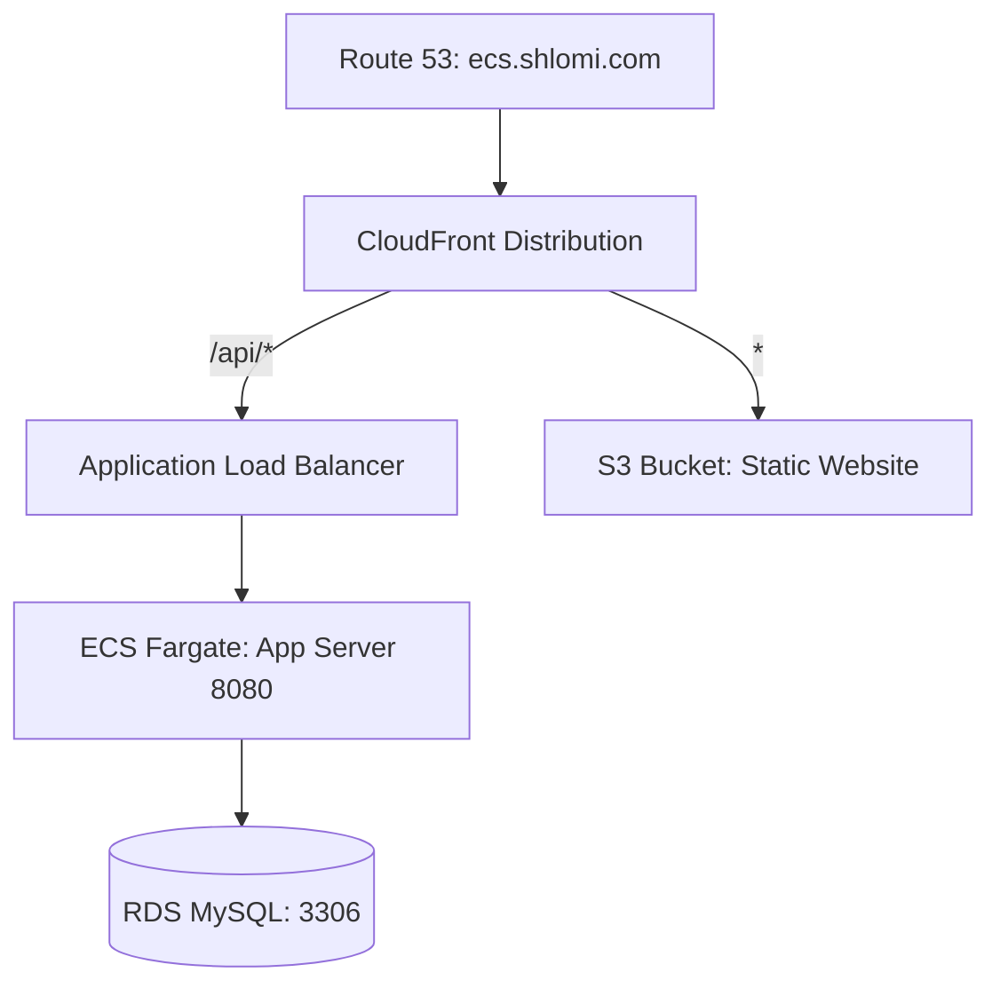

# ops-basic-spring - ECS Deployment on LocalStack with GitHub Actions

This project demonstrates a complete local deployment of a Spring Boot application to a simulated **Amazon ECS (Fargate)** service using **LocalStack**. It uses **Terraform** for Infrastructure as Code (IaC) and **GitHub Actions** (via a local self-hosted runner) for automated build and deployment pipelines.

---

## System Architecture

Below is the high-level routing and infrastructure architecture:



---

## Table of Contents
1. [System Architecture](#system-architecture)
2. [Prerequisites](#prerequisites)
3. [Infrastructure Setup (Terraform)](#infrastructure-setup-terraform)
4. [Local GitHub Actions Runner Setup](#local-github-actions-runner-setup)
5. [GitHub Repository Configuration](#github-repository-configuration)
6. [SSM Parameter Store Configuration](#ssm-parameter-store-configuration)
7. [Pipeline execution & Verification](#pipeline-execution--verification)
8. [Resource Cleanup](#resource-cleanup)

---

## Prerequisites

Before starting, ensure that the following tools are installed and running on your machine:

* **Docker & Docker Compose**
* **LocalStack** running in the background:
  ```bash
  localstack start
  ```
* **Terraform** CLI
* **terraform-local (tflocal)** CLI (Recommended). To install:
  ```bash
  # Create a python virtual environment and install
  python3 -m venv ~/venv
  source ~/venv/bin/activate
  python3 -m pip install terraform-local
  ```
* **MySQL Client** (for database connectivity verification)

---

## Infrastructure Setup (Terraform)

We use Terraform (or `tflocal`) to provision all local AWS resources in LocalStack (including RDS, ECS Cluster & Service, ECR, Application Load Balancer, S3, CloudFront, and IAM).

> [!NOTE]
> The [provider.tf](terraform/environments/dev/provider.tf) file is pre-configured to redirect all API calls to LocalStack at `http://localhost:4566`. You can run standard `terraform` commands or use `tflocal`.

### 1. Apply Terraform Configuration
Navigate to the Terraform dev environment directory and execute:
```bash
tflocal init
# OR: terraform init

tflocal apply -auto-approve
# OR: terraform apply -auto-approve
```

### 2. Verify Database (RDS) Initialization
During the provisioning phase, the Terraform module automatically executes the [init-db.sql](terraform/environments/dev/init-db.sql) script to create the database schema and application-level privileges:
* **Database Name:** `students_stage_ecs`
* **Application Username:** `students_staging_ecs`
* **Application Password:** `students_staging_ecs`

#### Manual Database Connection Verification:
Retrieve the local RDS Endpoint from the Terraform output:
```bash
tflocal output rds_endpoint
```

* **Connect as Master User:**
  ```bash
  mysql -h localhost.localstack.cloud -P 4510 -u admin -p'Unix11!!'
  ```
  *(or port `3306` if connecting from within a container on the same Docker network)*

* **Connect as Application User:**
  ```bash
  mysql -h localhost.localstack.cloud -P 4510 -u students_staging_ecs -pstudents_staging_ecs -D students_stage_ecs
  ```

> [!TIP]
> If you need to recreate the database or application user privileges manually, execute the following SQL queries as the Master User:
> ```sql
> CREATE DATABASE IF NOT EXISTS students_stage_ecs;
> CREATE USER IF NOT EXISTS 'students_staging_ecs'@'%' IDENTIFIED BY 'students_staging_ecs';
> GRANT ALL PRIVILEGES ON students_stage_ecs.* TO 'students_staging_ecs'@'%';
> FLUSH PRIVILEGES;
> ```

### 3. Retrieve IAM Credentials
To allow the GitLab Runner to authenticate and push images to LocalStack, retrieve the generated IAM credentials:
```bash
# Retrieve Access Key ID
tflocal output iam_access_key

# Retrieve Secret Access Key
tflocal output -raw iam_secret_key
```

---

## Local GitHub Actions Runner Setup

To run CI/CD workflows locally against LocalStack, you must configure a local **GitHub Actions Self-Hosted Runner** on your machine. This runner must have access to the local Docker daemon.

### Step 1: Create a Self-Hosted Runner in GitHub
1. Open your repository on GitHub.
2. Navigate to: **Settings** -> **Actions** -> **Runners**.
3. Click on **New self-hosted runner**.
4. Select your operating system (Windows / Linux / macOS) and architecture.
5. Follow the download and configuration commands provided in the GitHub UI.
6. When configuring the runner, set the runner label/tag to **`self-hosted`**.

### Step 2: Start the Runner
- **On Linux/macOS:** Run `./run.sh` in the runner directory.
- **On Windows:** Run `.\run.cmd` in the runner directory (or install it as a Windows Service).

Verify that the runner status in GitHub shows as **Idle** and **Active**.

---

## GitHub Repository Configuration

### 1. Push to GitHub and Branch Setup
1. Push this project to your new GitHub repository:
   ```bash
   git remote remove origin
   git remote add origin https://github.com/shlomi-sharbet/ops-basic-spring_back.git
   git checkout -b ecs
   git push -u origin ecs
   ```
2. Verify that the workflow file [.github/workflows/ci.yml](.github/workflows/ci.yml) specifies:
   ```yaml
   runs-on: self-hosted
   ```

### 2. Configure Secrets and Variables
In GitHub, go to **Settings** -> **Secrets and variables** -> **Actions** and define the following:

#### Repository Variables (Variables Tab):
| Variable Key | Value / Description |
| :--- | :--- |
| **`AWS_DEFAULT_REGION`** | `us-east-1` |
| **`CI_AWS_ECS_CLUSTER`** | `ecs-stage-cluster` |
| **`CI_AWS_ECS_SERVICE`** | `ecs-stage-service` |
| **`AWS_ENDPOINT`** | `http://localhost:4566` *(Use `http://host.docker.internal:4566` if your GitHub runner container is dockerized)* |
| **`DOCKER_REGISTRY`** | `000000000000.dkr.ecr.us-east-1.localhost.localstack.cloud:4566` |
| **`APP_NAME`** | `students-ecs` |

#### Repository Secrets (Secrets Tab):
| Secret Key | Value / Description |
| :--- | :--- |
| **`AWS_ACCESS_KEY_ID`** | AWS Access Key ID (e.g. `test` or from `tflocal output iam_access_key`) |
| **`AWS_SECRET_ACCESS_KEY`** | AWS Secret Access Key (e.g. `test` or from `tflocal output -raw iam_secret_key`) |

---

## SSM Parameter Store Configuration

> [!TIP]
> **This step is fully automated!** The Terraform `ssm` module automatically provisions these parameters in LocalStack with the dynamically generated RDS endpoint. You **do not** need to run any manual `put-parameter` commands.

If you wish to verify that the parameters were successfully created and check their values, run the following command (using `awslocal`):
```bash
awslocal ssm get-parameter --name "students_staging_ecs"

# Fallback using standard aws CLI:
# AWS_ACCESS_KEY_ID=test AWS_SECRET_ACCESS_KEY=test aws --endpoint-url=http://localhost:4566 ssm get-parameter --name "students_staging_ecs" --region us-east-1
```

To list all registered parameters:
```bash
awslocal ssm describe-parameters

# Fallback using standard aws CLI:
# AWS_ACCESS_KEY_ID=test AWS_SECRET_ACCESS_KEY=test aws --endpoint-url=http://localhost:4566 ssm describe-parameters --region us-east-1
```


---

## Pipeline execution & Verification

### 1. Trigger the Pipeline
Make a minor code change to verify that the pipeline builds the JAR, packages it as a Docker image, pushes it to ECR, and deploys it to ECS. For instance, modify the endpoint path or method name (e.g., change `getHighSatStudents` to `getHighSatStudents2`) in:
[StudentsController.java](src/main/java/com/handson/basic/controller/StudentsController.java)

*By doing this, you will be able to see the change reflected under the `students-controller` section in the Swagger UI once the deployment completes.*

After modifying, commit and push your changes to the `ecs` branch:
```bash
git add src/main/java/com/handson/basic/controller/StudentsController.java
git commit -m "update getHighSatStudents test"
git push origin ecs
```

Navigate to the **Actions** tab in your GitHub repository UI to watch the workflow compile the Java application via Maven, build the Docker image, upload it to the local ECR repository, and update the ECS service.

### 2. Verify Application via Application Load Balancer
Once the deployment succeeds and the task is healthy, you can access the Swagger UI:
* **Swagger API Endpoint:** [http://springboot-lb.elb.localhost.localstack.cloud:8080/swagger-ui.html](http://springboot-lb.elb.localhost.localstack.cloud:8080/swagger-ui.html)

> [!TIP]
> **Functional Test:** You can use the Swagger UI to create a new student record by calling the `POST` endpoint under `student-controller`. Enter the student's details, including a test username and password, and execute the request to save it to the RDS database.

### 3. Verify Application via CloudFront (End-to-End Integration)

Since this repository only hosts the backend application, the frontend (Angular) code is managed in a separate GitHub repository: [ops-basic-angular_front](https://github.com/shlomi-sharbet/ops-basic-angular_front). The frontend has its own pipeline that automatically builds and syncs the static files to the S3 bucket (`shlomi.backend.students`) in LocalStack whenever a change is pushed.

Through CloudFront, both repositories are unified under a single domain:
* **Frontend UI (Static Web):** Default behavior (`*`) routes traffic to the S3 website origin.
* **Backend API (Spring Boot):** The `/api/*` path pattern routes traffic to the ECS Application Load Balancer.

To verify the full integration:
1. Ensure the **Backend** is deployed and running on ECS (via this GitLab pipeline).
2. Ensure the **Frontend** is deployed to S3 (via your frontend GitHub Actions pipeline, making sure it points to the same local LocalStack S3 bucket).
3. Retrieve the CloudFront domain name from the Terraform outputs:
   ```bash
   tflocal output cloudfront_domain_name
   ```
4. Access the application in your browser at:
   `http://<cloudfront_domain_name>.cloudfront.localhost.localstack.cloud`
5. Try logging in to the frontend UI using the **username** and **password** of the student you created in Step 2 via Swagger.
6. Verify that the login succeeds and that requests to `/api/...` in the Browser DevTools (Network tab) are correctly routed to the backend and resolve with `200 OK` status codes without encountering CORS issues.

---

## Troubleshooting & Common Issues

* **Docker daemon connection errors in GitHub Actions:**
  If the workflow fails with `Cannot connect to the Docker daemon`, ensure that the user running the self-hosted runner has the necessary permissions to access the docker socket (e.g., added to the `docker` group on Linux) and that Docker is running.
* **Connection issues to LocalStack:**
  If the runner cannot reach LocalStack, verify that LocalStack is running (`localstack status`). If your runner is running directly on the host, ensure `AWS_ENDPOINT` is configured as `http://localhost:4566`. If it is dockerized, make sure it is configured to use `http://host.docker.internal:4566` and has access to the host gateway.
* **Database Connection Timeout:**
  If the Spring Boot application fails to connect to the database, use the manual connection commands in [Verify Database Initialization](#manual-database-connection-verification) to verify that the RDS instance is running and the database and users exist.

---

## Resource Cleanup

To stop and destroy all local resources running in LocalStack, run:
```bash
tflocal destroy -auto-approve
# OR: terraform destroy -auto-approve
```
