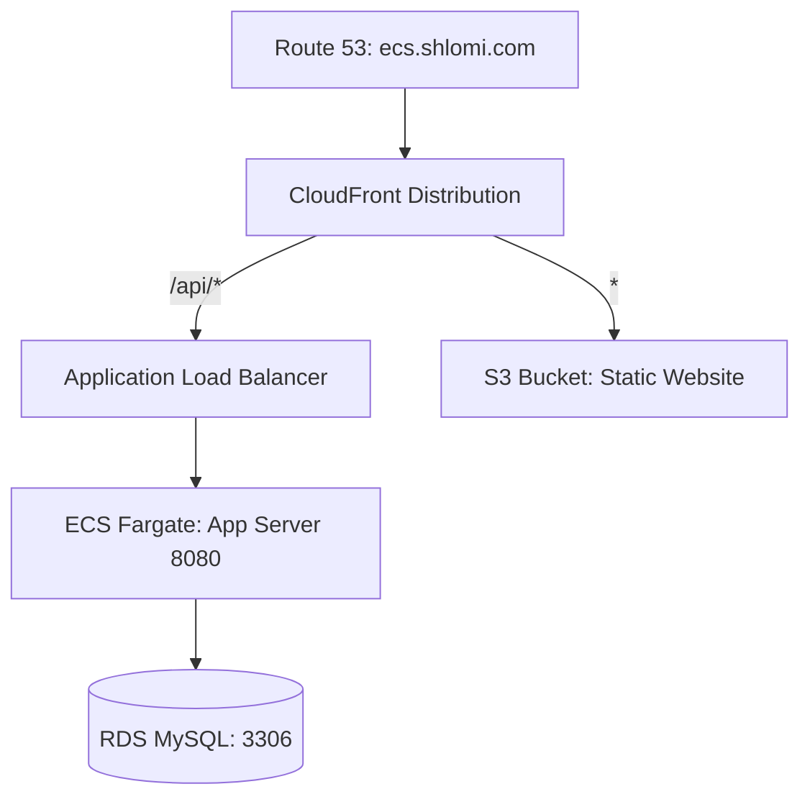

# ops-basic-spring - ECS Deployment on LocalStack with GitHub Actions

This project demonstrates a complete local deployment of a Spring Boot application to a simulated **Amazon ECS (Fargate)** service using **LocalStack**. It uses **Terraform** for Infrastructure as Code (IaC) and **GitHub Actions** (via a local self-hosted runner) for automated build and deployment pipelines.

---

## System Architecture

Below is the high-level routing and infrastructure architecture:



---

## Prerequisites

Before starting, ensure that the following tools are installed and running on your machine:

* **Docker & Docker Compose**
* **LocalStack** running in the background (`localstack start`)
* **Terraform** CLI
* **terraform-local (tflocal)** CLI (Recommended). To install:
  ```bash
  # Create a python virtual environment and install
  python3 -m venv ~/venv
  source ~/venv/bin/activate
  python3 -m pip install terraform-local
  ```
* **MySQL Client** (for database connectivity verification)

---

## Local Setup & Execution

We use Terraform (or `tflocal`) to provision all local AWS resources in LocalStack (RDS, ECS, ECR, ALB, S3, CloudFront, and IAM).

### 1. Apply Terraform Configuration
Navigate to the Terraform dev environment directory (`terraform/environments/dev`) and run:
```bash
tflocal init
# OR: terraform init

tflocal apply -auto-approve
# OR: terraform apply -auto-approve
```

### 2. Verify Database (RDS) Initialization
The Terraform module automatically runs the `init-db.sql` script to create the database schema:
* **Database Name:** `students_stage_ecs`
* **Application Username:** `students_staging_ecs`
* **Application Password:** `students_staging_ecs`

#### Manual Database Connection Verification
Retrieve the local RDS Endpoint:
```bash
tflocal output rds_endpoint
```
Connect as Master User:
```bash
mysql -h localhost.localstack.cloud -P 4510 -u admin -p'Unix11!!'
```
Connect as Application User:
```bash
mysql -h localhost.localstack.cloud -P 4510 -u students_staging_ecs -pstudents_staging_ecs -D students_stage_ecs
```

---

## Deployment & Runner Setup

### 1. Local GitHub Actions Runner Setup
To run CI/CD workflows locally against LocalStack, you must configure a local **GitHub Actions Self-Hosted Runner**:
1. Open your repository on GitHub.
2. Navigate to: **Settings** -> **Actions** -> **Runners**.
3. Click on **New self-hosted runner** and follow the configuration steps.
4. Set the runner label/tag to **`self-hosted`**.
5. Start the runner (run `./run.sh` on Linux/macOS or `.\run.cmd` on Windows).

### 2. Trigger the Pipeline (Verification Exercise)
Every commit pushed to the `ecs` branch triggers the pipeline (builds the JAR, packages it in a Docker image, pushes to ECR, and updates ECS).

To verify the integration:
1. Modify a response or method name (e.g., change `getHighSatStudents` to `getHighSatStudents2`) in:
   [StudentsController.java](src/main/java/com/handson/basic/controller/StudentsController.java)

*By doing this, you will be able to see the change reflected under the `students-controller` section in the Swagger UI once the deployment completes.*

After modifying, commit and push your changes to the `ecs` branch:
   ```bash
   git add src/main/java/com/handson/basic/controller/StudentsController.java
   git commit -m "update getHighSatStudents test"
   git push origin ecs
   ```
3. Navigate to the **Actions** tab in your GitHub repository UI to watch the workflow compile the Java application via Maven, build the Docker image, upload it to ECR, and update the ECS service.

### 3. Verify Application via Application Load Balancer
Once the deployment succeeds and the task is healthy, you can access the Swagger UI:
* **Swagger API Endpoint:** [http://springboot-lb.elb.localhost.localstack.cloud:8080/swagger-ui.html](http://springboot-lb.elb.localhost.localstack.cloud:8080/swagger-ui.html)

> [!TIP]
> **Functional Test:** You can use the Swagger UI to create a new student record by calling the `POST` endpoint under `student-controller`. Enter the student's details, including a test username and password, and execute the request to save it to the RDS database.

### 4. Verify Application via CloudFront (End-to-End Integration)

Since this repository only hosts the backend application, the frontend (Angular) code is managed in a separate GitHub repository: [ops-basic-angular_front](https://github.com/shlomi-sharbet/ops-basic-angular_front). The frontend has its own pipeline that automatically builds and syncs the static files to the S3 bucket (`shlomi.backend.students`) in LocalStack whenever a change is pushed.

Through CloudFront, both repositories are unified under a single domain:
* **Frontend UI (Static Web):** Default behavior (`*`) routes traffic to the S3 website origin.
* **Backend API (Spring Boot):** The `/api/*` path pattern routes traffic to the ECS Application Load Balancer.

To verify the full integration:
1. Ensure the **Backend** is deployed and running on ECS (via this GitHub Actions pipeline).
2. Ensure the **Frontend** is deployed to S3 (via your frontend GitHub Actions pipeline, making sure it points to the same local LocalStack S3 bucket).
3. Retrieve the CloudFront domain name from the Terraform outputs:
  ```bash
  tflocal output cloudfront_domain_name
  ```
4. Access the application in your browser at:
   `http://<cloudfront_domain_name>.cloudfront.localhost.localstack.cloud`
5. Try logging in to the frontend UI using the **username** and **password** of the student you created via Swagger (in the previous step).
6. Verify that the login succeeds and that requests to `/api/...` in the Browser DevTools (Network tab) are correctly routed to the backend and resolve with `200 OK` status codes without encountering CORS issues.
---

## Configuration & Secrets

### 1. GitHub Variables & Secrets
Configure the following in GitHub under **Settings** -> **Secrets and variables** -> **Actions**:

#### Variables:
* `AWS_DEFAULT_REGION`: `us-east-1`
* `CI_AWS_ECS_CLUSTER`: `ecs-stage-cluster`
* `CI_AWS_ECS_SERVICE`: `ecs-stage-service`
* `AWS_ENDPOINT`: `http://localhost:4566` (use `http://host.docker.internal:4566` if runner is containerized)
* `DOCKER_REGISTRY`: `000000000000.dkr.ecr.us-east-1.localhost.localstack.cloud:4566`
* `APP_NAME`: `students-ecs`

#### Secrets:
* `AWS_ACCESS_KEY_ID`: Retrieve using `tflocal output iam_access_key` (or use `test`)
* `AWS_SECRET_ACCESS_KEY`: Retrieve using `tflocal output -raw iam_secret_key` (or use `test`)

### 2. SSM Parameter Store
The application parameters are provisioned automatically in LocalStack SSM Parameter Store by Terraform. You can check them using:
```bash
awslocal ssm describe-parameters
```

---

## Troubleshooting & Common Issues

* **Workflow stuck on "Waiting for a runner" (Job is queued):**
  * **Cause:** The workflow specifies `runs-on: self-hosted` but your local runner is offline or missing the correct label.
  * **Fix:** Ensure your runner is running in your WSL terminal (`./run.sh`) and shows as **Idle** under **Settings -> Actions -> Runners** in GitHub.
* **Command not found errors in the pipeline (`mvn`, `aws`, or `docker`):**
  * **Cause:** Since the GitHub self-hosted runner runs directly on your host system (unlike GitLab's container executor), all build tools must be installed on your WSL machine.
  * **Fix:** Install Maven, AWS CLI, and Docker on WSL and ensure they are in the PATH of the user executing the runner.
* **Pipeline fails to connect to ECR/ECS (`Connection Refused` on port 4566):**
  * **Cause:** LocalStack is not running or has crashed.
  * **Fix:** Run `localstack status` or check `docker ps` to verify LocalStack is running and listening on port `4566`.
* **Spring Boot task fails to start (Database Connection Timeout):**
  * **Cause:** The application cannot connect to the RDS container, or the DB credentials are not in the SSM Parameter Store.
  * **Fix:** Verify that the database parameters were provisioned in LocalStack using `awslocal ssm describe-parameters`. Check database connectivity manually using the commands in [Manual Database Connection Verification](#manual-database-connection-verification).

---

## Resource Cleanup

To stop and destroy all local resources running in LocalStack, run:
```bash
tflocal destroy -auto-approve
# OR: terraform destroy -auto-approve
```
