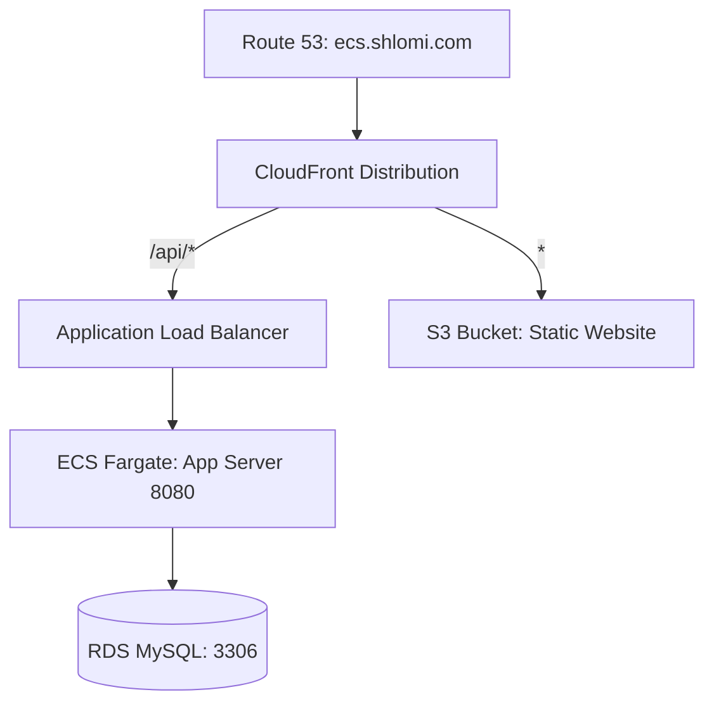

# ops-basic-spring - ECS Deployment on LocalStack with GitLab CI/CD

This project demonstrates a complete local deployment of a Spring Boot application to a simulated **Amazon ECS (Fargate)** service using **LocalStack**. It uses **Terraform** for Infrastructure as Code (IaC) and **GitLab CI/CD** (via a local GitLab Runner) for automated build and deployment pipelines.

---

## System Architecture

Below is the high-level routing and infrastructure architecture:



---

## Table of Contents
1. [System Architecture](#system-architecture)
2. [Prerequisites](#prerequisites)
3. [Infrastructure Setup (Terraform)](#infrastructure-setup-terraform)
4. [Local GitLab Runner Setup](#local-gitlab-runner-setup)
5. [GitLab Project Configuration](#gitlab-project-configuration)
6. [SSM Parameter Store Configuration](#ssm-parameter-store-configuration)
7. [Pipeline execution & Verification](#pipeline-execution--verification)
8. [Resource Cleanup](#resource-cleanup)

---

## Prerequisites

Before starting, ensure that the following tools are installed and running on your machine:

* **Docker & Docker Compose**
* **LocalStack** running in the background:
  ```bash
  localstack start
  ```
* **Terraform** CLI
* **terraform-local (tflocal)** CLI (Recommended). To install:
  ```bash
  # Create a python virtual environment and install
  python3 -m venv ~/venv
  source ~/venv/bin/activate
  python3 -m pip install terraform-local
  ```
* **MySQL Client** (for database connectivity verification)

---

## Infrastructure Setup (Terraform)

We use Terraform (or `tflocal`) to provision all local AWS resources in LocalStack (including RDS, ECS Cluster & Service, ECR, Application Load Balancer, S3, CloudFront, and IAM).

> [!NOTE]
> The [provider.tf](terraform/environments/dev/provider.tf) file is pre-configured to redirect all API calls to LocalStack at `http://localhost:4566`. You can run standard `terraform` commands or use `tflocal`.

### 1. Apply Terraform Configuration
Navigate to the Terraform dev environment directory and execute:
```bash
tflocal init
# OR: terraform init

tflocal apply -auto-approve
# OR: terraform apply -auto-approve
```

### 2. Verify Database (RDS) Initialization
During the provisioning phase, the Terraform module automatically executes the [init-db.sql](terraform/environments/dev/init-db.sql) script to create the database schema and application-level privileges:
* **Database Name:** `students_stage_ecs`
* **Application Username:** `students_staging_ecs`
* **Application Password:** `students_staging_ecs`

#### Manual Database Connection Verification:
Retrieve the local RDS Endpoint from the Terraform output:
```bash
tflocal output rds_endpoint
```

* **Connect as Master User:**
  ```bash
  mysql -h localhost.localstack.cloud -P 4510 -u admin -p'Unix11!!'
  ```
  *(or port `3306` if connecting from within a container on the same Docker network)*

* **Connect as Application User:**
  ```bash
  mysql -h localhost.localstack.cloud -P 4510 -u students_staging_ecs -pstudents_staging_ecs -D students_stage_ecs
  ```

> [!TIP]
> If you need to recreate the database or application user privileges manually, execute the following SQL queries as the Master User:
> ```sql
> CREATE DATABASE IF NOT EXISTS students_stage_ecs;
> CREATE USER IF NOT EXISTS 'students_staging_ecs'@'%' IDENTIFIED BY 'students_staging_ecs';
> GRANT ALL PRIVILEGES ON students_stage_ecs.* TO 'students_staging_ecs'@'%';
> FLUSH PRIVILEGES;
> ```

### 3. Retrieve IAM Credentials
To allow the GitLab Runner to authenticate and push images to LocalStack, retrieve the generated IAM credentials:
```bash
# Retrieve Access Key ID
tflocal output iam_access_key

# Retrieve Secret Access Key
tflocal output -raw iam_secret_key
```

---

## Local GitLab Runner Setup

To run CI/CD jobs locally against LocalStack, you must configure a local GitLab Runner in a Docker container. The runner requires elevated privileges (`privileged = true`) to support Docker-in-Docker (DinD) image building.

### Step 1: Launch the Runner Container
Start the GitLab Runner container, mapping the host's Docker socket and persisting configuration to a volume named `gitlab-runner-config`:
```bash
docker run -d --name gitlab-runner --restart always \
  -v /var/run/docker.sock:/var/run/docker.sock \
  -v gitlab-runner-config:/etc/gitlab-runner \
  gitlab/gitlab-runner:latest
```

### Step 2: Create a Project Runner in GitLab
1. Open your project on GitLab.
2. Navigate to: **Settings** -> **CI/CD** -> Expand **Runners**.
3. Click on **New project runner**.
4. Configure tags for the runner (e.g., `my-local-runner`).
5. Click **Create runner** and copy the generated **Runner token**.

### Step 3: Register the Runner
Register the runner container using the following command:
```bash
docker run --rm -it -v gitlab-runner-config:/etc/gitlab-runner gitlab/gitlab-runner:latest register
```

Provide the following answers when prompted in the terminal:
1. **GitLab instance URL:** Enter `https://gitlab.com/`
2. **Registration token:** Paste the token copied in Step 2.
3. **Description:** Enter a description (e.g., `my-docker-runner`).
4. **Tags:** Enter the tag you defined (e.g., `my-local-runner`).
5. **Executor:** Enter **`docker`**.
6. **Default Docker image:** Enter **`docker:dind`**.

### Step 4: Configure Privileged Mode (Mandatory for DinD)
The GitLab CI/CD jobs run `docker build` commands inside the runner container. Thus, the runner executor must be configured with `privileged = true`.

1. Open the runner's configuration file (`config.toml`) using a temporary Alpine editor:
   ```bash
   docker run --rm -it -v gitlab-runner-config:/etc/gitlab-runner alpine vi /etc/gitlab-runner/config.toml
   ```
2. Locate the `[runners.docker]` section and change `privileged = false` to **`privileged = true`**:
   ```toml
   [runners.docker]
     privileged = true
   ```
   *(In the `vi` editor: navigate to the line, press `i` to enter insert mode, make changes, press `Esc`, type `:wq` and press Enter to save and exit).*
3. Restart the runner container to apply the configuration:
   ```bash
   docker restart gitlab-runner
   ```

---

## GitLab Project Configuration

### 1. Import Repository and Branch Setup
1. Create a new repository in GitLab and import this project.
2. Create and switch to a branch named `ecs`.
3. Verify that the jobs in your [.gitlab-ci.yml](.gitlab-ci.yml) file target your local runner via the correct tag:
   ```yaml
   tags:
     - my-local-runner
   ```

### 2. Configure CI/CD Variables
In GitLab, go to **Settings** -> **CI/CD** -> Expand **Variables** and define the following variables (ensure **Protect variable** is unchecked if your `ecs` branch is not protected):

| Variable Key | Value / Description |
| :--- | :--- |
| **`AWS_ACCESS_KEY_ID`** | tflocal output iam_access_key |
| **`AWS_SECRET_ACCESS_KEY`** | tflocal output -raw iam_secret_key |
| **`AWS_DEFAULT_REGION`** | `us-east-1` |
| **`CI_AWS_ECS_CLUSTER`** | `ecs-stage-cluster` |
| **`CI_AWS_ECS_SERVICE`** | `ecs-stage-service` |

---

## SSM Parameter Store Configuration

> [!TIP]
> **This step is fully automated!** The Terraform `ssm` module automatically provisions these parameters in LocalStack with the dynamically generated RDS endpoint. You **do not** need to run any manual `put-parameter` commands.

If you wish to verify that the parameters were successfully created and check their values, run the following command (using `awslocal`):
```bash
awslocal ssm get-parameter --name "students_staging_ecs"

# Fallback using standard aws CLI:
# AWS_ACCESS_KEY_ID=test AWS_SECRET_ACCESS_KEY=test aws --endpoint-url=http://localhost:4566 ssm get-parameter --name "students_staging_ecs" --region us-east-1
```

To list all registered parameters:
```bash
awslocal ssm describe-parameters

# Fallback using standard aws CLI:
# AWS_ACCESS_KEY_ID=test AWS_SECRET_ACCESS_KEY=test aws --endpoint-url=http://localhost:4566 ssm describe-parameters --region us-east-1
```


---

## Pipeline execution & Verification

### 1. Trigger the Pipeline
Make a minor code change to verify that the pipeline builds the JAR, package it as a Docker image, pushes it to ECR, and deploys it to ECS. For instance, modify the endpoint path or method name (e.g., change `getHighSatStudents` to `getHighSatStudents2`) in:
[StudentsController.java](src/main/java/com/handson/basic/controller/StudentsController.java)

*By doing this, you will be able to see the change reflected under the `students-controller` section in the Swagger UI once the deployment completes.*

After modifying, commit and push your changes to the `ecs` branch:
```bash
git add src/main/java/com/handson/basic/controller/StudentsController.java
git commit -m "update getHighSatStudents test"
git push origin ecs
```

Navigate to **Build** -> **Pipelines** in your GitLab project UI to watch the runner compile the Java application via Maven, build the Docker image, upload it to the local ECR repository, and update the ECS service.

### 2. Verify Application via Application Load Balancer
Once the deployment succeeds and the task is healthy, you can access the Swagger UI:
* **Swagger API Endpoint:** [http://springboot-lb.elb.localhost.localstack.cloud:8080/swagger-ui.html](http://springboot-lb.elb.localhost.localstack.cloud:8080/swagger-ui.html)

> [!TIP]
> **Functional Test:** You can use the Swagger UI to create a new student record by calling the `POST` endpoint under `student-controller`. Enter the student's details, including a test username and password, and execute the request to save it to the RDS database.

### 3. Verify Application via CloudFront (End-to-End Integration)

Since this repository only hosts the backend application, the frontend (Angular) code is managed in a separate GitHub repository. The frontend has its own pipeline that builds and syncs the static files to the S3 bucket (`shlomi.backend.students`) in LocalStack.

Through CloudFront, both repositories are unified under a single domain:
* **Frontend UI (Static Web):** Default behavior (`*`) routes traffic to the S3 website origin.
* **Backend API (Spring Boot):** The `/api/*` path pattern routes traffic to the ECS Application Load Balancer.

To verify the full integration:
1. Ensure the **Backend** is deployed and running on ECS (via this GitLab pipeline).
2. Ensure the **Frontend** is deployed to S3 (via your frontend GitHub Actions pipeline, making sure it points to the same local LocalStack S3 bucket).
3. Retrieve the CloudFront domain name from the Terraform outputs:
   ```bash
   tflocal output cloudfront_domain_name
   ```
4. Access the application in your browser at:
   `http://<cloudfront_domain_name>.cloudfront.localhost.localstack.cloud`
5. Try logging in to the frontend UI using the **username** and **password** of the student you created in Step 2 via Swagger.
6. Verify that the login succeeds and that requests to `/api/...` in the Browser DevTools (Network tab) are correctly routed to the backend and resolve with `200 OK` status codes without encountering CORS issues.

---

## Troubleshooting & Common Issues

* **Docker daemon connection errors in GitLab CI:**
  If the pipeline fails with `Cannot connect to the Docker daemon`, make sure that you configured `privileged = true` in your runner's `config.toml` (under `[runners.docker]`) and restarted the runner (`docker restart gitlab-runner`).
* **Connection issues to `host.docker.internal`:**
  If the runner cannot reach LocalStack, verify that LocalStack is running (`localstack status`). If you are running on a Linux/WSL2 host, you may need to add `--add-host=host.docker.internal:host-gateway` to the runner configuration or verify your Docker network settings.
* **Database Connection Timeout:**
  If the Spring Boot application fails to connect to the database, use the manual connection commands in [Verify Database Initialization](#manual-database-connection-verification) to verify that the RDS instance is running and the database and users exist.

---

## Resource Cleanup

To stop and destroy all local resources running in LocalStack, run:
```bash
tflocal destroy -auto-approve
# OR: terraform destroy -auto-approve
```
